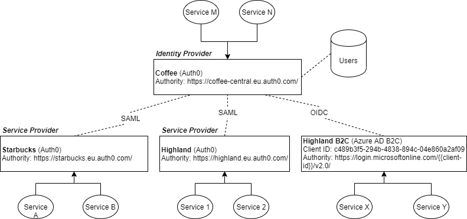
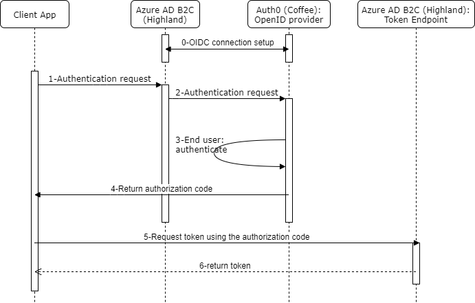
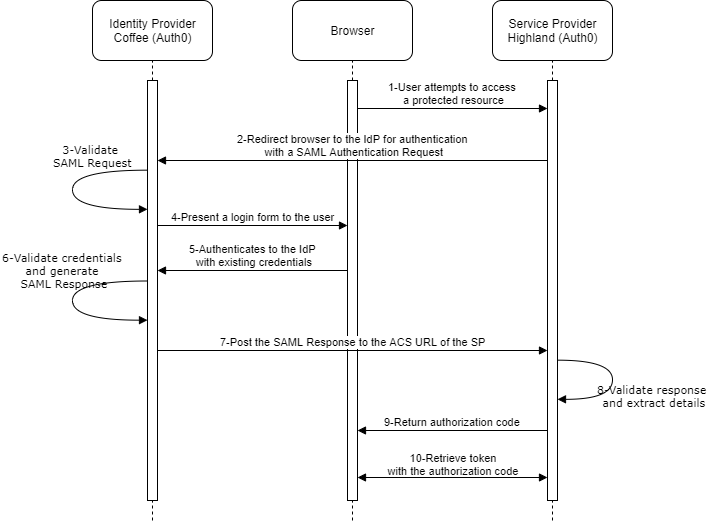

# Usage
### Backend
dotnet run

### Frontend
cd ClientApp

npm install

npm start

### Sample users
admin@coffee.com

user@coffee.com

pass: Rosen2019!

# Architecture
### Diagrams

<!--#### OIDC Flow-->
<!---->

#### SAML Flow

<!--*Source: https://www.elastic.co/blog/how-to-enable-saml-authentication-in-kibana-and-elasticsearch*-->

### Scenario
We have 4 applications, each one has its own service (including backend and frontend), and an identity provider (IDP).

The BE of one app can understand tokens issued by its IDP only. For example, Starbucks's BE can only understand tokens issued by Starbucks's IDP.

Question: how can we login into Starbucks, Highland and Highland B2C using Coffee's user credentials?

### Implementation
The BE and FE of all 4 apps are left untouched. The IdPs are setup as following:
* For SAML
    * Coffee acts as SAML Identity Provider using Auth0
    * Starbucks and Highland act as SAML Service Provider using Auth0

* For OIDC: in Highland B2C (Azure AD B2C), we config a OIDC connection using Coffee (Auth0)'s client id, client secret, and some other information.

Result: When user login into a service using Coffee's user credentials, the Coffee will generate a token whose issuer is from the service's IdP itself.

# References
- https://auth0.com/docs/protocols/saml/samlsso-auth0-to-auth0#8-create-the-html-page-for-a-test-application
- https://hackernoon.com/federated-identities-a-developers-primer-655a160d66cb
- https://www.youtube.com/watch?v=6H3iOIWaSzM
